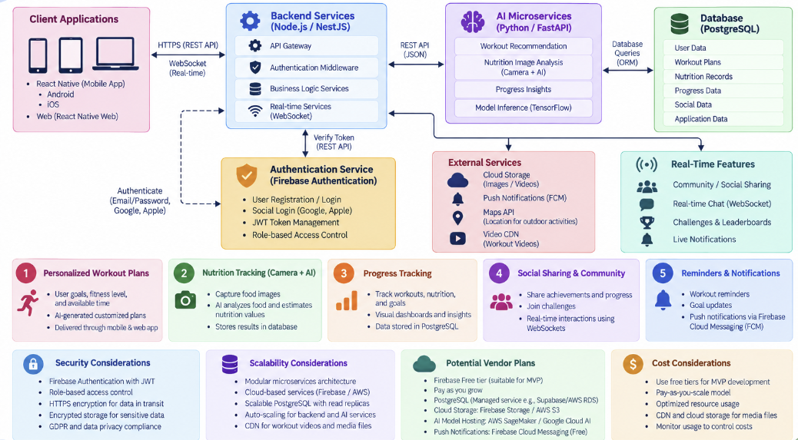
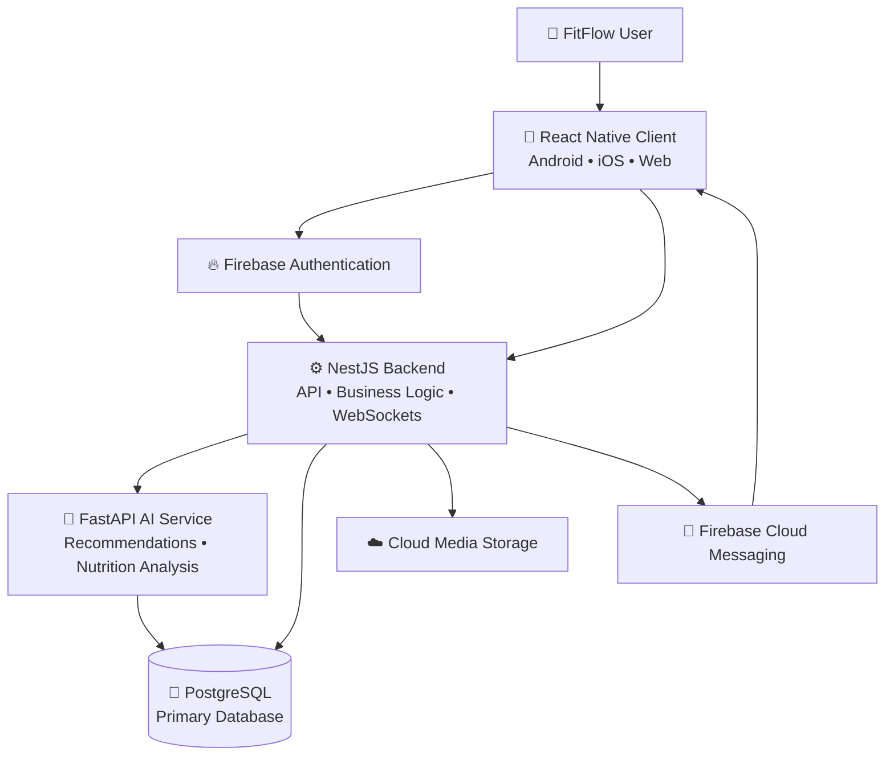

<div align="center">

# 🏋️ FitFlow Redesign

### ✨ Human-Centered Fitness • Intelligent Personalization • Privacy by Design


**Prepared for:** IT3060 – Human Computer Interaction  
**Programme:** BSc (Hons) in Information Technology – Year 3, Semester 2  
**Student:** K K D I Dahamya  
**Student ID:** IT23542938

---

> 💡 **FitFlow Redesign** is a technology-selection and high-level architecture project that transforms the HCI findings from previous lab activities into a practical, scalable, secure, and AI-ready technical direction for a modern fitness and nutrition application.

</div>

---

## 📌 Table of Contents

- [🎯 Project Overview](#-project-overview)
- [🧭 Project Goals](#-project-goals)
- [🧠 HCI Design Context](#-hci-design-context)
- [🏆 Selected Technology Stack](#-selected-technology-stack)
- [💡 Why This Stack?](#-why-this-stack)
- [📊 Technology Decision Summary](#-technology-decision-summary)
- [🏗️ High-Level Architecture](#️-high-level-architecture)
- [🔄 Core Data Flows](#-core-data-flows)
- [🔐 Security and Privacy](#-security-and-privacy)
- [📁 Repository Structure](#-repository-structure)
- [🚀 Getting Started](#-getting-started)
- [🛠️ CI/CD](#️-cicd)
- [📚 Documentation](#-documentation)
- [⚠️ Scope and Limitations](#️-scope-and-limitations)
- [👤 Author](#-author)

---

## 🎯 Project Overview

FitFlow is a fitness and nutrition application redesign focused on:

- 🏋️ Personalized workout recommendations
- 📷 Camera-assisted nutrition tracking
- 📈 Progress monitoring and visual dashboards
- 👥 Social sharing, community interaction, and challenges
- 🔔 Workout reminders and push notifications
- 🤖 AI-assisted personalization
- 🔐 Secure authentication and privacy-aware data handling
- 🌐 Cross-platform access across Android, iOS, and web

The goal of this repository is to organize the outputs of the previous activities into a clear technical foundation for the redesigned FitFlow system.

---

## 🧭 Project Goals

| Goal | Description |
|---|---|
| 📱 Cross-platform experience | Provide a consistent experience across Android, iOS, and web |
| ⚡ Performance | Support smooth workouts, dashboards, and camera-based features |
| ♻️ Code reuse | Reduce duplicated development work across platforms |
| 🤖 AI readiness | Support personalized workouts and nutrition analysis |
| 🔌 Efficient integration | Connect application, AI, database, and authentication services cleanly |
| 💬 Real-time interaction | Support community features, notifications, and live updates |
| 🔐 Privacy | Protect personal fitness and health-related information |
| 📈 Scalability | Allow the system to support a growing number of users |
| 🛠️ Maintainability | Keep the architecture manageable for a mid-sized team |
| 💰 Cost awareness | Avoid unnecessary infrastructure and operational cost |

---

## 🧠 HCI Design Context

The technology decisions are based on FitFlow's usability and functional needs identified during the earlier HCI activities.

### Important user needs

- Clear and understandable navigation
- Simple and quick workout access
- Personalized recommendations
- Exercise instructions and guidance
- Progress visualization
- Reminders and goal support
- Social/community interaction
- Privacy-aware handling of user information
- Accessible and understandable interfaces

### Design implications

| Area | Technical Implication |
|---|---|
| 👥 Social sharing | Visibility and access should be controlled before sharing |
| 📷 Nutrition tracking | Camera access and image-processing support are required |
| 🤖 AI recommendations | Recommendations need a separate AI-capable service layer |
| 🔔 Reminders | Push notification support is required |
| 🧭 Navigation | Cross-platform UI should remain consistent |
| 📊 Progress | Structured historical data must be stored and queried efficiently |
| 🔐 Privacy | Authentication, authorization, and secure data handling are essential |

---

## 🏆 Selected Technology Stack

| Layer | Selected Technology | Primary Role |
|---|---|---|
| 📱 Frontend | **React Native + React Native Web** | Cross-platform mobile and web user interface |
| ⚙️ Main Backend | **Node.js / NestJS** | APIs, business logic, authentication middleware, real-time services |
| 🤖 AI Service | **Python / FastAPI** | AI/ML inference, workout recommendation, nutrition analysis |
| 🗄️ Database | **PostgreSQL** | Structured application, fitness, nutrition, and progress data |
| 🔐 Authentication | **Firebase Authentication** | Registration, login, token-based identity management |
| 🔔 Notifications | **Firebase Cloud Messaging** | Push reminders and goal notifications |
| ☁️ Media Storage | **Cloud Object Storage** | Workout videos and uploaded/captured images |
| 🚀 CI/CD | **GitHub Actions** | Repository validation and automation |

---

## 💡 Why This Stack?

### ⚛️ React Native

React Native is selected as the primary frontend technology because it provides strong code reuse across Android and iOS while also supporting web development through React Native Web.

**Advantages**

- Shared JavaScript/TypeScript codebase
- Fast development
- Large ecosystem
- Native camera and notification integration
- Strong Firebase support
- WebSocket support for real-time features
- Suitable for interactive fitness interfaces

**Consideration**

Some advanced platform-specific features may still require native modules or optimization.

---

### 🟥 Node.js / NestJS

NestJS is used for the main application backend.

**Responsibilities**

- REST API endpoints
- Authentication middleware
- Business logic
- Workout and nutrition operations
- Progress management
- Social/community logic
- WebSocket-based real-time communication
- Communication with the AI service
- PostgreSQL access

Its modular TypeScript architecture provides a structured backend suitable for future growth.

---

### 🤖 Python / FastAPI

AI functionality is separated into a Python-based FastAPI service.

**Why separate the AI service?**

Python provides a strong ecosystem for:

- Machine learning
- Computer vision
- Recommendation systems
- Model inference
- Future AI experimentation

Keeping AI functionality independent prevents the main application backend from becoming tightly coupled to model implementation.

---

### 🐘 PostgreSQL

PostgreSQL is used as the main system-of-record database.

It is suitable for structured relationships such as:

- Users
- Workout plans
- Nutrition records
- Progress data
- Social/community data
- Application records

**Key advantages**

- Strong relational modeling
- ACID transactions
- Complex queries and reporting
- Mature indexing
- Reliable data consistency
- Strong ecosystem and managed-cloud support

---

### 🔥 Firebase Authentication

Firebase Authentication handles identity management.

**Planned capabilities**

- Email/password login
- Google sign-in
- Apple sign-in
- Token-based authentication
- Integration with mobile and web applications

> Authentication identifies the user, while the backend remains responsible for authorization and access-control decisions.

---

## 📊 Technology Decision Summary

### Main Decision Criteria

| Criterion | Weight |
|---|---:|
| ⚡ Performance | 20% |
| 📈 Scalability | 15% |
| 🚀 Development Speed | 15% |
| 🔐 Security | 15% |
| 💰 Cost | 10% |
| 🤖 AI/ML Support | 10% |
| 💬 Real-Time Support | 5% |
| 🛠️ Maintainability | 10% |

### Weighted Scores

| Technology | Weighted Score |
|---|---:|
| React Native | **4.80 / 5** |
| Node.js / NestJS | **4.70 / 5** |
| PostgreSQL | **4.35 / 5** |
| Firebase Authentication | **4.75 / 5** |

Detailed comparisons and scoring are available in the [`docs/`](docs/) folder.

---

## 🏗️ High-Level Architecture



The architecture separates client applications, backend services, AI microservices, authentication, data storage, external integrations, and real-time functionality.

### Main architecture layers



---

## 🔄 Core Data Flows

### 🏋️ 1. Personalized Workout Plan

```text
User
  ↓
React Native Client
  ↓
NestJS API
  ↓
FastAPI AI Service
  ↓
User Goals + Fitness Level + Available Time
  ↓
Generated Workout Recommendation
  ↓
PostgreSQL
  ↓
React Native Client
```

The response can include:

- Recommended workout plan
- Exercise sequence
- Workout duration
- Goal-related guidance
- Progress-aware recommendations

---

### 📷 2. Nutrition Tracking

```text
User
  ↓
Camera / Image Input
  ↓
React Native Client
  ↓
NestJS Backend
  ↓
FastAPI Nutrition Analysis
  ↓
Estimated Nutrition Information
  ↓
PostgreSQL
  ↓
User Progress View
```

Uploaded media can be stored separately in cloud object storage while PostgreSQL keeps structured records and references.

---

### 👥 3. Social & Community Interaction

```text
User
  ↓
React Native Client
  ↓
Authentication + Authorization Check
  ↓
NestJS Backend
  ↓
Community / Challenge Logic
  ↓
PostgreSQL + WebSocket Updates
  ↓
Approved Participants
```

Access to private social information should depend on explicit application permissions and backend authorization.

---

### 🔔 4. Reminders & Notifications

```text
Workout / Goal Event
  ↓
NestJS Backend
  ↓
Firebase Cloud Messaging
  ↓
Push Notification
  ↓
React Native Client
```

---

## 🔐 Security and Privacy

FitFlow handles personal fitness and health-related information, so security is treated as a system-wide requirement.

### Security Principles

| Principle | Implementation Direction |
|---|---|
| 🔒 Encryption in transit | HTTPS / TLS |
| 🗄️ Secure storage | Database and cloud-storage encryption |
| 👤 Authentication | Firebase Authentication |
| 🛡️ Authorization | Backend role and permission checks |
| 🔑 Secret management | Environment variables; secrets excluded from Git |
| 📉 Least privilege | Grant only required permissions |
| 🧾 Auditability | Log important security and access events |
| ⏳ Temporary access | Use short-lived or restricted access where appropriate |
| 🧹 Data minimization | Collect only information required by FitFlow features |
| 🌍 Privacy awareness | Design with GDPR-style privacy principles in mind |

### Important Repository Rule

**Never commit real API keys, passwords, service-account credentials, or `.env` files to GitHub.**

---

## 📁 Repository Structure

```text
fitflow-redesign/
│
├── frontend/
│   └── README.md
│
├── backend/
│   └── README.md
│
├── ai-service/
│   └── README.md
│
├── docs/
│   ├── architecture/
│   │   └── fitflow-high-level-architecture.png
│   │
│   ├── adr/
│   │   └── ADR-001-technology-stack.md
│   │
│   ├── supporting-documents/
│   │   └── HCI-Lab-Report-05.docx
│   │
│   ├── 01-frontend-comparison.md
│   ├── 02-backend-database-auth-comparison.md
│   ├── 03-technology-comparison-matrix.md
│   ├── 04-weighted-decision-matrix.md
│   ├── 05-tech-stack-summary.md
│   └── 06-github-setup-guide.md
│
├── .github/
│   └── workflows/
│       └── repo-check.yml
│
├── .env.example
├── .gitignore
└── README.md
```

---

## 🚀 Getting Started

> ℹ️ This repository currently represents the **Activity 5 project scaffold and architecture documentation**, not a completed production application.

### 1. Clone the repository

```bash
git clone https://github.com/YOUR_USERNAME/fitflow-redesign.git
cd fitflow-redesign
```

### 2. Frontend

```bash
cd frontend
```

The frontend implementation is planned with React Native / React Native Web.

### 3. Backend

```bash
cd backend
```

The backend implementation is planned with Node.js / NestJS.

### 4. AI Service

```bash
cd ai-service
```

The AI service implementation is planned with Python / FastAPI.

### 5. Environment Configuration

Use the provided:

```text
.env.example
```

as a reference for environment variables.

> ⚠️ Never commit real secrets or `.env` credentials to the repository.

---

## 🛠️ CI/CD

A basic GitHub Actions workflow is included under:

```text
.github/workflows/repo-check.yml
```

The workflow validates the presence of the essential Activity 5 repository files and documentation.

### Recommended branch protection

For the `main` branch:

- ✅ Block force pushes
- ✅ Prevent branch deletion
- ✅ Require pull requests before merging when collaborating
- ✅ Require successful status checks before merge

---

## 📚 Documentation

The repository includes the supporting work from the previous activities:

| Document | Purpose |
|---|---|
| `01-frontend-comparison.md` | Compares React Native, Flutter, Kotlin Multiplatform, and Swift/SwiftUI |
| `02-backend-database-auth-comparison.md` | Compares backend, database, and authentication choices |
| `03-technology-comparison-matrix.md` | Summarizes the strongest options by system component |
| `04-weighted-decision-matrix.md` | Shows weighted scoring and decision criteria |
| `05-tech-stack-summary.md` | Summarizes the final recommended technology stack |
| `ADR-001-technology-stack.md` | Records the architecture decision and rationale |
| `fitflow-high-level-architecture.png` | Visual representation of the selected architecture |
| `HCI-Lab-Report-05.docx` | Supporting lab report |

---

## ⚠️ Scope and Limitations

This repository focuses on:

- Technology evaluation
- Architecture design
- Repository setup
- Supporting documentation
- Initial project structure

It does **not** yet represent a fully implemented production version of FitFlow.

Future implementation may include:

- Full React Native UI
- Complete NestJS APIs
- Trained AI/ML models
- Database schema and migrations
- Automated unit/integration testing
- Production deployment
- Monitoring and observability

---

## 👤 Author

**K K D I Dahamya**  
**Student ID:** IT23542938  
**Module:** IT3060 – Human Computer Interaction  
**Lab:** Lab Report 05

---

<div align="center">

### 💪 FitFlow — Smarter Workouts, Healthier Choices

**React Native • NestJS • FastAPI • PostgreSQL • Firebase**

</div>
